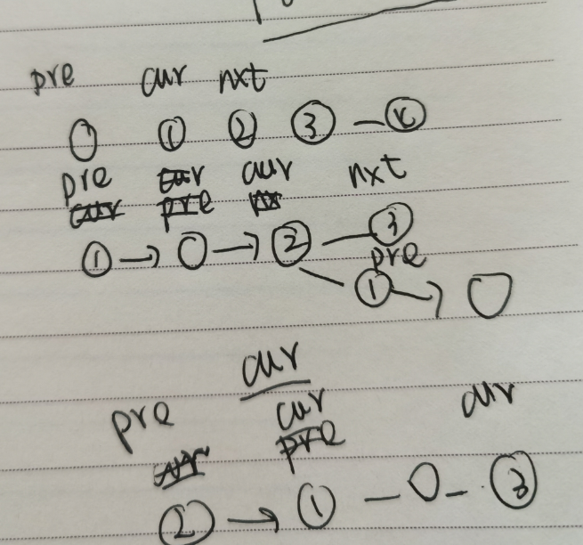

#题目
每k个链表翻转

# 思路

# 解析
```go
func reverseKGroup(head *ListNode, k int) *ListNode {
    cur :=head
    for i := 0; i<k ; i++ {
        if cur == nil {
            return head
        }
        cur = cur.Next
    }
    newhead := reverse(head,cur)
    head.Next = reverseKGroup(cur,k)
    return newhead
}

//翻转链表
func reverse(start, end *ListNode) *ListNode {
    var pre *ListNode

    cur :=  start
    for cur != end {
        next := cur.Next
        cur.Next = pre
        pre  = cur
        cur = next                                                                                                                                                                                                                                                                                                                                                                                        
    }
    return pre
}
```