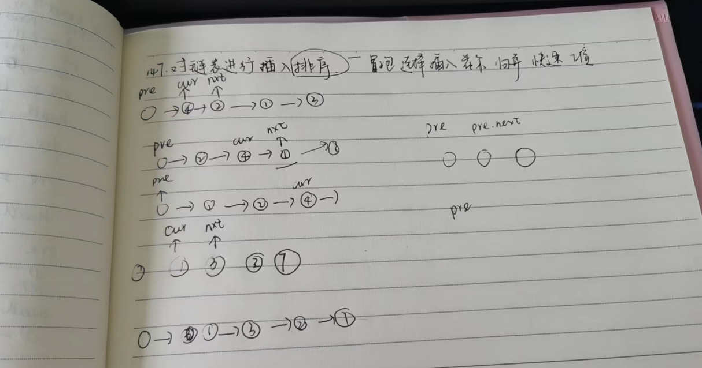

it# 题目

# 思路


# 解析
```go
/**
 * Definition for singly-linked list.
 * type ListNode struct {
 *     Val int
 *     Next *ListNode
 * }
 */
func insertionSortList(head *ListNode) *ListNode {
    // 找到待插入值，移除temp
    //从前往后遍历链表，插入，cur.Val <= temp, cur.next.Val > temp
    dummy := &ListNode{Val: 0 , Next : head}
    
    cur := head
    for cur != nil && cur.Next != nil {
        if cur.Val > cur.Next.Val {
            //移除
            temp := cur.Next
            cur.Next = cur.Next.Next
            pre :=  dummy
            for pre.Next.Val < temp.Val{
                pre = pre.Next
            }
            temp.Next = pre.Next
            pre.Next = temp
        }else{
            //推进
           cur= cur.Next
        }
    }

    return dummy.Next
}
```