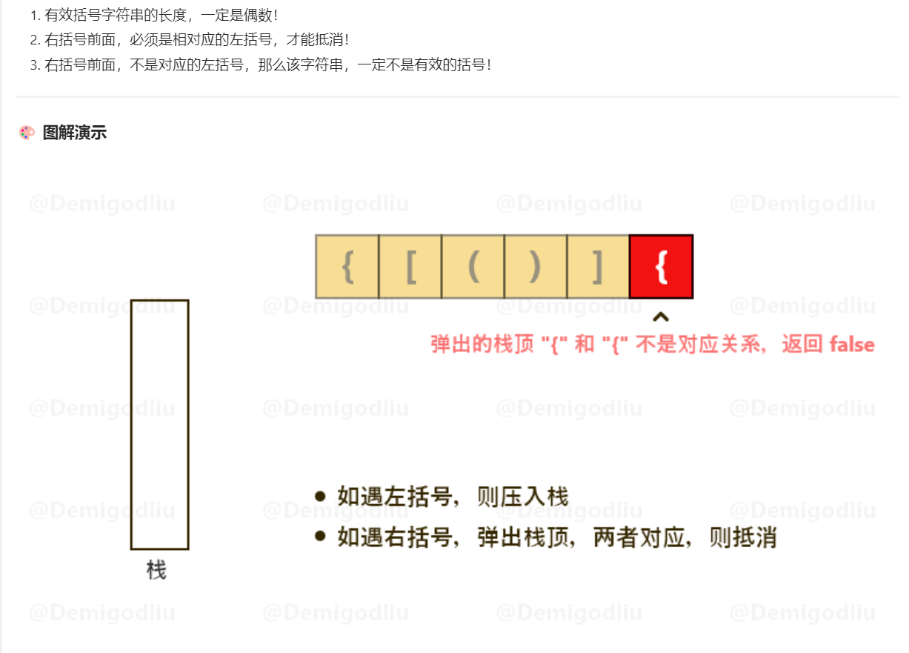

## 题目
用栈实现括号匹配
## 思路

## 解析
```go
func isValid(s string) bool {
    n := len(s)
    if n %2 == 1 {
        return false
    }

    stack := []byte{}
    pairs := map[byte]byte{
        '}' : '{',
        ']' : '[',
        ')' : '(',
    }

    for i :=0 ; i< n ;i++ {
        //字符串是右括号
        if pairs[s[i]] > 0 {
            //如果右括号前栈为空
            //栈顶和右括号不匹配
            if len(stack) ==0 || pairs[s[i]] != stack[len(stack)-1] {
                return false
            }else{
                stack = stack[:len(stack)-1]
            }
        }else{
			//左括号入栈
            stack =append(stack,s[i])
        }
    }
    return len(stack) == 0

}
```