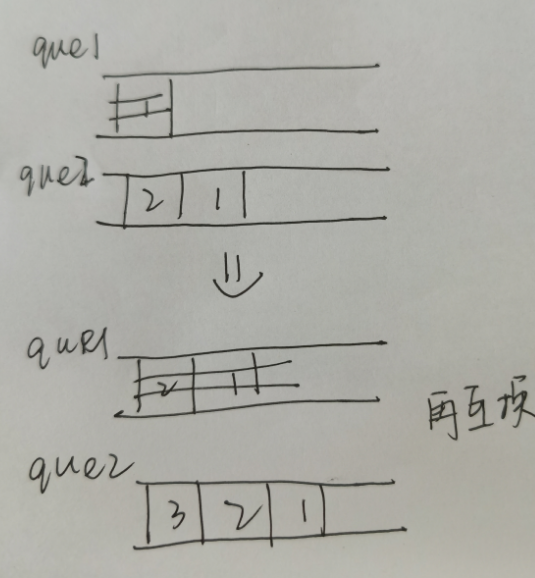

## 题目

## 思路
用一个que1队列放翻转后的队列，que2做辅助队列负责翻转

## 解析
```go
type MyQueue struct {
    inStack,outStack []int

}


func Constructor() MyQueue {
    return  MyQueue{}

}

func (this *MyQueue) Push(x int)  {
    this.inStack = append(this.inStack, x)
}

func (this *MyQueue) in2out() {
    for len(this.inStack)>0 {
        this.outStack = append(this.outStack,this.inStack[len(this.inStack)-1])
        this.inStack = this.inStack[:len(this.inStack)-1]
    }
}

func (this *MyQueue) Pop() int {
    if len(this.outStack)== 0 {
        this.in2out()
    }
    var x int
    x = this.outStack[len(this.outStack)-1]
    this.outStack = this.outStack[:len(this.outStack)-1]
    return x
}


func (this *MyQueue) Peek() int {
    if len(this.outStack)== 0 {
        this.in2out()
    }
    var x int
    x = this.outStack[len(this.outStack)-1]
    return x
}


func (this *MyQueue) Empty() bool {
 return len(this.inStack) == 0 && len(this.outStack)== 0 

}
```