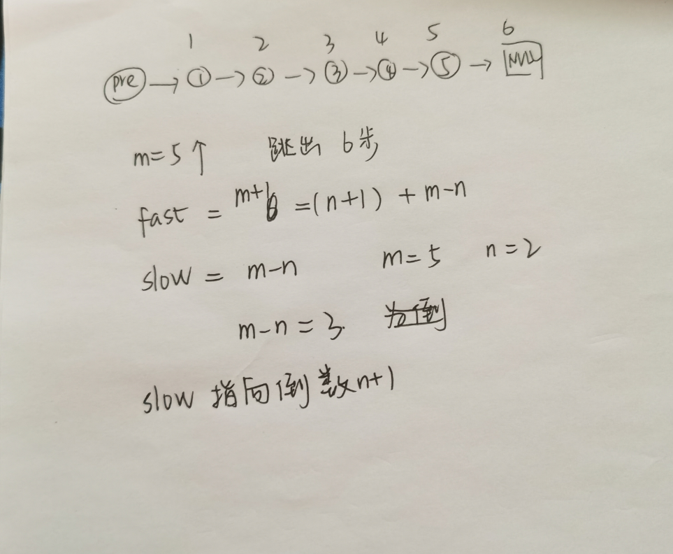

# 题目
删除倒数第n个数
# 思路
双指针，fast:先走n+1步，slow开始，fast指向末尾，slow指向倒数第n+1


# 解析
```go
func removeNthFromEnd(head *ListNode, n int) *ListNode {
    num := 0 
    result:=ListNode{}
    result.Next = head
    fast := &result
    slow := &result
    for num < n+1 {
        fast = fast.Next
        num ++
    }
    for fast != nil {
        slow = slow.Next
        fast = fast.Next
    }
    ex := slow.Next
    slow.Next = ex.Next
    return result.Next
}
```