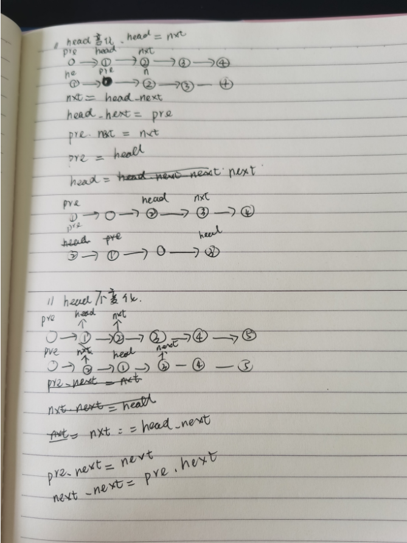

## 题目

## 思路


## 解析
```go 
func reverseList(head *ListNode) *ListNode {
    //两种方法
    //第一种，head不变
    dummy := &ListNode{Val:0,Next:head}
    pre := dummy
    cur := head

    for cur != nil && cur.Next != nil {
        next := cur.Next
        cur.Next = next.Next
        next.Next = pre.Next
        pre.Next = next     
    }

    return dummy.Next

}
```
```go
func reverseList(head *ListNode) *ListNode {
    //两种方法
    //第二种 head变
    var pre *ListNode 
    cur := head

    for cur != nil {
        next := cur.Next
        cur.Next =pre
        pre = cur
        cur = next
    }

    return pre

}
```